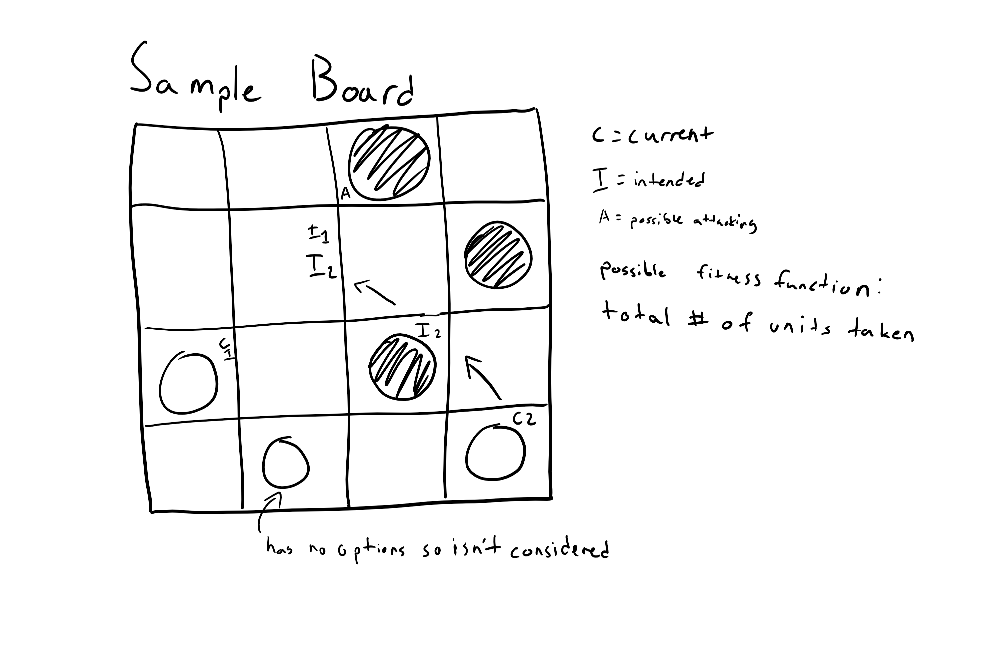

# CPSC4610-AI-Checkers

Seattle University (SQ 2019)  
An implementation of the game of checkers with an AI player for the user to compete against.

Goal: Our goal is to create an intelligent AI that will rely on board state to determine the next best move and (Ideally) beat a human player. Utilizing algorithms learned throughout the course of CPSC4610, we will build the AI player to compete at the level of the user.

Will Lathrop  
[lathropw@seattleu.edu](mailto:lathropw@seattleu.edu)

Nick Jones  
[jonesn6@seattleu.edu](mailto:jonesn6@seattleu.edu)

Relevant links:  
[AI Checkers | Computer Science and Engineering | Taylor University](https://cse.taylor.edu/projects/ai-checkers/)  
[Checkers with Artificial Intelligence | Czech Technical University in Prague](https://dspace.cvut.cz/bitstream/handle/10467/61630/F3-BP-2015-Dolezal-Matej-BP.pdf?sequence=11&isAllowed=y)  
[Reinforcement Learning Project: AI Checkers Player | University Utrecht](https://www.researchgate.net/publication/242405861_Reinforcement_learning_project_AI_Checkers_Player)
